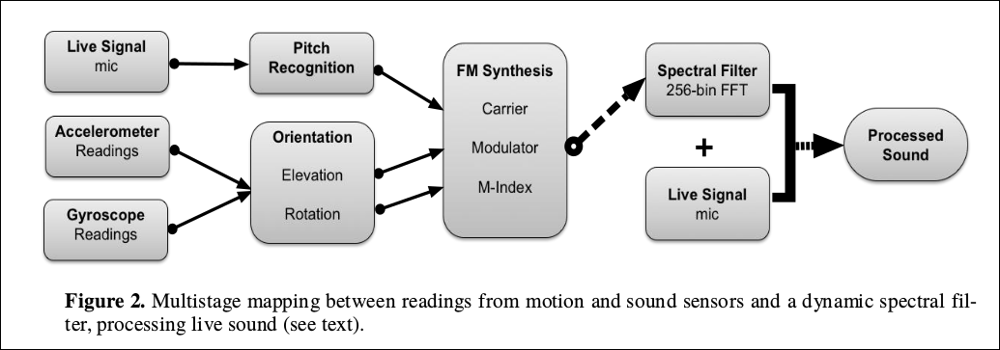
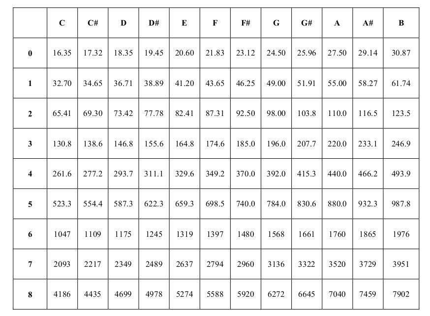
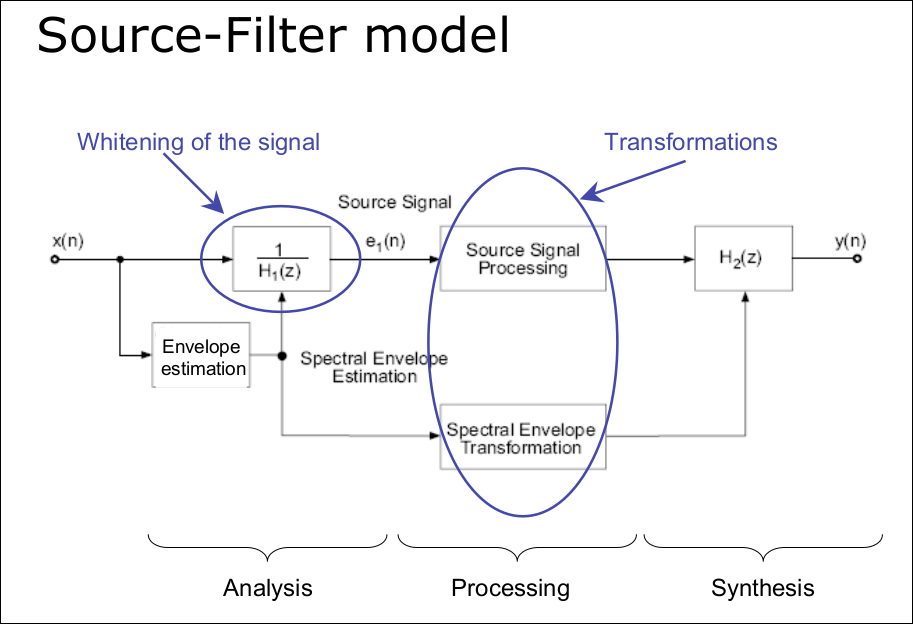

<h2>Table of Contents</h2>

<ul>
<li><a href="#orga16bf36">1. Do Mobile Phones Dream Of Electronic Orchestras ?</a>
<ul>
<li><a href="#orgbe88709">1.1. Original Repertoire</a>
<ul>
<li><a href="#orgfe55504">1.1.1. Mapping accelerometer: up-down -&gt; spectral richness and (left-right) -&gt; fundamental frequency for FM synthesis</a></li>
<li><a href="#orgd22d86d">1.1.2. Preprogrammed modulation ratios and pitches for selection</a></li>
<li><a href="#org6d842ec">1.1.3. Circle map effect</a></li>
<li><a href="#org1ecaacf">1.1.4. DJ control loopback rate by tilting and changes timbre based on accelerometer</a></li>
<li><a href="#org89c7aac">1.1.5. Using it as a diffuser in space</a></li>
</ul>
</li>
</ul>
</li>
<li><a href="#orgf30e512">2. Ocarina</a>
<ul>
<li><a href="#org5a9ee07">2.1. Physical interaction design process</a>
<ul>
<li><a href="#orga171231">2.1.1. How many points multi touch allowed ?</a></li>
<li><a href="#orgd70ad8f">2.1.2. Uses accelerometer for vibrato (left-right), timbre(front-back)</a></li>
<li><a href="#org893c62b">2.1.3. Using ChucK to track amplitude of incoming signal</a></li>
</ul>
</li>
<li><a href="#orge5c3da3">2.2. Sound synthesis</a>
<ul>
<li><a href="#orgd599d36">2.2.1. ChucK program consists of amplitude tracker and articulator</a></li>
</ul>
</li>
</ul>
</li>
<li><a href="#org932b6ed">3. Toolkits</a>
<ul>
<li><a href="#org3a65f94">3.1. STK (Synthesis Toolkit)</a></li>
</ul>
</li>
<li><a href="#org178c543">4. Feature Analysis</a>
<ul>
<li><a href="#org7d459f2">4.1. RMS of a window of samples or Highest sample as -&gt; <b>Amplitude</b></a></li>
<li><a href="#org40cc675">4.2. Number of zero crossings -&gt; <b>Pitch</b></a></li>
</ul>
</li>
<li><a href="#org903f269">5. Ideas</a>
<ul>
<li><a href="#org8c93c3b">5.1. MOGAT: Auditory training for pitch perception, pitch production</a></li>
<li><a href="#org6068658">5.2. Gesture-based Interactive Re-mixeable Dance Floor (GIRD) Music Tech Fest</a></li>
<li><a href="#org84f2d3b">5.3. ChoirMob, Vuzik</a></li>
<li><a href="#org81731e9">5.4. Granular Synthesis</a></li>
<li><a href="#org4223e90">5.5. UrMus live coding</a></li>
<li><a href="#org6665270">5.6. SuperCollider</a></li>
<li><a href="#org0300aa3">5.7. Overtone</a></li>
<li><a href="#org5ebfd86">5.8. OpenSound Control (OSC)</a></li>
<li><a href="#orgd0d380a">5.9. Magnetic Interation</a></li>
<li><a href="#org2ac77f0">5.10. Sonic Tennis. Play tennis with spatial audio feedback</a></li>
<li><a href="#org3863b09">5.11. Using digital compass</a></li>
<li><a href="#org8caf524">5.12. Sound bounce</a></li>
<li><a href="#org35771de">5.13. MoMu API</a></li>
<li><a href="#org5d85d6a">5.14. PureData Open Source of Max</a></li>
<li><a href="#orga7aa4fc">5.15. ChucK</a></li>
<li><a href="#orgaa869db">5.16. MIT Spring 2015</a></li>
<li><a href="#orgdeea842">5.17. MIT Spring 2016</a></li>
<li><a href="#org7811648">5.18. Fall 2016</a></li>
<li><a href="#org4b8b25e">5.19. Planet CCRMA</a></li>
<li><a href="#org1377cca">5.20. DJ Controller</a></li>
<li><a href="#org1d30ef5">5.21. Dynamic Performance Augmentation: Vocal Harmonizer, Arpeggiator, Chord Changer, Harmonic Synthesizer</a></li>
<li><a href="#orgdde49c3">5.22. Magic Baton control tempo, EQ level based on hand movements with particles effect</a></li>
<li><a href="#org13a362f">5.23. Snakio: Eat musical notes with powerup which changes music played</a></li>
<li><a href="#orgb999d83">5.24. Explore Spotify playlist: Can change attributes for song recommendation</a></li>
<li><a href="#org3e5bbed">5.25. Guided chord progression. Uses the library "Synth"</a></li>
<li><a href="#org82c631b">5.26. Using hand gestures to create different effects to be added during live performance</a></li>
<li><a href="#org86689f7">5.27. Record small segment of audio to be used later for synthesis</a></li>
</ul>
</li>
<li><a href="#org43b8b3e">6. Mapping motion to timbre: FM Synthesis</a>
<ul>
<li><a href="#org60cb2a5">6.1. </a></li>
<li><a href="#org762f3d3">6.2. Mapping:</a>
<ul>
<li><a href="#orga97993d">6.2.1. Pitch recognition = carrier frequency</a></li>
<li><a href="#orgf69fde4">6.2.2. elevation = modulation ratio</a></li>
<li><a href="#org7fef9e3">6.2.3. rotation = modulation index</a></li>
</ul>
</li>
</ul>
</li>
<li><a href="#orgc333590">7. Interactive Virtual Percussion</a>
<ul>
<li><a href="#orgedb149b">7.1. Editing mode allows for creation of virtual instruments from different materials</a></li>
<li><a href="#orga31407a">7.2. Sound synthesis: Physical waveguide synthesis (Cook 2007)</a></li>
</ul>
</li>
<li><a href="#org9bad228">8. The Interactive Music Producer</a>
<ul>
<li><a href="#org5180ff6">8.1. Music &amp; Sound Production</a>
<ul>
<li><a href="#org2eb0301">8.1.1. Ableton Live, Max for Live, PureData, Max</a></li>
<li><a href="#org0a58e79">8.1.2. Composing interactive music (Winkler 1998)</a></li>
</ul>
</li>
<li><a href="#org7260ce0">8.2. Interactive Technologies</a>
<ul>
<li><a href="#org7520934">8.2.1. user experience and they way music is perceived</a></li>
<li><a href="#org3f0c018">8.2.2. Music and Human-Computer Interaction (Holland 2013)</a></li>
</ul>
</li>
<li><a href="#orgc41362f">8.3. Data Mapping and Manipulation</a>
<ul>
<li><a href="#org9c27f78">8.3.1. Interactive Music 3.0(Quay 2012), Making Motion Musical (Bevilacqua), Drummond 2009</a></li>
<li><a href="#org28a72ee">8.3.2. Wekinator, Gesture Follower</a></li>
<li><a href="#orgd874cbd">8.3.3. Dynamic Music Objects (Thalmann 2016)</a></li>
</ul>
</li>
</ul>
</li>
<li><a href="#org94187a8">9. AuRal: A Mobile Interactive System for Geo-Locative Audio Synthesis</a>
<ul>
<li><a href="#org3ebb89f">9.1. Client App</a>
<ul>
<li><a href="#org6cba879">9.1.1. Uses Android port of SuperCollider</a></li>
<li><a href="#orgd3b02d6">9.1.2. Uses spatial data to synthesize sound</a></li>
</ul>
</li>
</ul>
</li>
<li><a href="#orgaaf8886">10. Game Design for Expressive Mobile Music</a>
<ul>
<li><a href="#org501cbe6">10.1. Magic Piano: simple, hardcoded music note and pitch</a></li>
<li><a href="#org8d0f6e5">10.2. Magic Fiddle</a></li>
<li><a href="#orgbae1e7a">10.3. Ocarina</a></li>
<li><a href="#org52c6c96">10.4. Leaf Trombone</a></li>
</ul>
</li>
<li><a href="#org0f928bb">11. Grab &amp; Play: Creative Mapping</a>
<ul>
<li><a href="#orgaef23e7">11.1. Based on Wekinator with additional features:</a>
<ul>
<li><a href="#org8698fea">11.1.1. Interface with any synthesizer that accepts OSC messages</a></li>
<li><a href="#orgbd51e6e">11.1.2. Source Code</a></li>
</ul>
</li>
</ul>
</li>
<li><a href="#org84b02c9">12. Sound Synthesis: History &amp; Theory</a>
<ul>
<li><a href="#org927ebb5">12.1. Oscillator = generates waveforms at different pitch</a>
<ul>
<li><a href="#org62a930e">12.1.1. Triangle</a></li>
<li><a href="#org0028268">12.1.2. Saw</a></li>
<li><a href="#org8d9b5b6">12.1.3. Square</a></li>
<li><a href="#org11cb6c1">12.1.4. Pulse</a></li>
</ul>
</li>
<li><a href="#orgae6f1ba">12.2. Filter = Timbre</a>
<ul>
<li><a href="#orgde17088">12.2.1. Subtractive synthesis removes some frequencies or emphasis some</a></li>
</ul>
</li>
<li><a href="#orgb5f6314">12.3. Amplifer = Amplitude</a>
<ul>
<li><a href="#org89fe944">12.3.1. Varying amplitude modify characteristics. marimba and accordion</a></li>
</ul>
</li>
<li><a href="#org89c6465">12.4. Low Frequency Oscillator (LFO)</a>
<ul>
<li><a href="#orgf790726">12.4.1. Low sub-audible frequency range where its output use as source of modulation</a></li>
</ul>
</li>
<li><a href="#org522e100">12.5. Envelope generator (ASDR)</a>
<ul>
<li><a href="#org0f25e7f">12.5.1. modulation source to control synthesizer parameter</a></li>
<li><a href="#orgd0a09b0">12.5.2. Attack time, Decay Time,  Sustain Level, Release Time</a></li>
<li><a href="#org7bbb129">12.5.3. Create filter sweep and create volume shape in amplifier to mimic certain instruments</a></li>
</ul>
</li>
</ul>
</li>
<li><a href="#org7362827">13. Electronic Music Synthesis &amp; Audio Effects Processing</a>
<ul>
<li><a href="#orgd83a204">13.1. Music notes, pitch and octave</a>
<ul>
<li><a href="#org407d27d">13.1.1. Characterized by fundamental frequency and its ratios = overtones</a></li>
<li><a href="#org0a2d525">13.1.2. </a></li>
</ul>
</li>
<li><a href="#org57d3a51">13.2. Timbre &amp; Physical Modelling</a>
<ul>
<li><a href="#org889b28c">13.2.1. Tone quality. Charateristic quality of a sound often used to discern instruments</a></li>
<li><a href="#org5572a16">13.2.2. Frequency Spectrum (relative energy distribution of partials) affect timbre</a></li>
<li><a href="#org01d9a42">13.2.3. Variation in amplitude such as attack and fade time also affet timbre</a></li>
</ul>
</li>
<li><a href="#org4aed5a3">13.3. Additive synthesis</a>
<ul>
<li><a href="#org865b081">13.3.1. using sinusoids of different frequency and amplitude ratio</a></li>
</ul>
</li>
<li><a href="#org4cc7d5d">13.4. FM Synthesis</a></li>
<li><a href="#org46544ad">13.5. Audio Effects</a>
<ul>
<li><a href="#org8882230">13.5.1. Echo (repeat signal after a delay with reduced gain)</a></li>
<li><a href="#orgd03868e">13.5.2. Reverb (persistence of sound after being produced due to reflection)</a></li>
<li><a href="#orgeb39be9">13.5.3. Flanging</a></li>
<li><a href="#org933edb1">13.5.4. Chorus</a></li>
<li><a href="#org9738b66">13.5.5. Bass (tone in low-pitched range)</a></li>
<li><a href="#org6bb38ed">13.5.6. Treble (high frequency)</a></li>
<li><a href="#org884670b">13.5.7. WahWah Effect (altering resonance of musical notes)</a></li>
<li><a href="#org8a1cdba">13.5.8. Tremolo (variation of amplitude)</a></li>
<li><a href="#orgcffb7bc">13.5.9. Fade In Fade Out</a></li>
</ul>
</li>
</ul>
</li>
<li><a href="#org446871b">14. Synthesis Techniques</a>
<ul>
<li><a href="#orgf556ac2">14.1. Additive Synthesis</a></li>
<li><a href="#orgcfbc2c2">14.2. Source-filter</a>
<ul>
<li><a href="#orgd39c8e2">14.2.1. </a></li>
<li><a href="#orgc9332dc">14.2.2. Amplitude Modulation</a></li>
<li><a href="#org5dd0158">14.2.3. Frequency Modulation</a></li>
</ul>
</li>
</ul>
</li>
<li><a href="#orgdb7bb2a">15. Gesture-Sound Mapping by Demonstration in Interactive Music Systems</a>
<ul>
<li><a href="#org0087f43">15.1. Hierarchical Approach to Mapping</a>
<ul>
<li><a href="#orga9b57b9">15.1.1. Template-based learning with single example</a></li>
</ul>
</li>
<li><a href="#org5b7b841">15.2. Multimodal modelling of gesture-sound mapping</a>
<ul>
<li><a href="#orge03f0aa">15.2.1. multimodal HMM modelling dependencies between gesture and sound</a></li>
</ul>
</li>
</ul>
</li>
<li><a href="#orga99ec73">16. Machine Learning in Automatic Chord Generation</a>
<ul>
<li><a href="#org361173a">16.1. Related work</a>
<ul>
<li><a href="#org4cf3258">16.1.1. Simon HMM and 60 chords for interactive product</a></li>
<li><a href="#orga154c59">16.1.2. Paiement uses multilevel graphical model to generate chord progression</a></li>
<li><a href="#org7bd9d2e">16.1.3. Legaspi uses genetic algorithm</a></li>
</ul>
</li>
<li><a href="#orgfa73c52">16.2. Methodology</a>
<ul>
<li><a href="#org5b9773e">16.2.1. Random Forest</a></li>
<li><a href="#orgb2ced70">16.2.2. HMM</a></li>
</ul>
</li>
<li><a href="#org08a158c">16.3. Aim</a>
<ul>
<li><a href="#org80df7c5">16.3.1. Given an a music piece with several measures. Predict chord for each measure</a></li>
</ul>
</li>
</ul>
</li>
<li><a href="#orgae1f64e">17. MUSICAL AUDIO SYNTHESIS USING AUTOENCODING NEURAL NETS</a></li>
<li><a href="#orgc9ebd66">18. Random ideas</a>
<ul>
<li><a href="#orgfc7ac27">18.1. Health</a></li>
<li><a href="#org36340b1">18.2. Education</a></li>
<li><a href="#org380153f">18.3. Live interaction during concert</a></li>
<li><a href="#orgad2d7ed">18.4. Game: Multiplayer or Single player</a></li>
<li><a href="#org60f8de9">18.5. Karaoke-like</a></li>
<li><a href="#orgb9b0bc9">18.6. Natural sound: animals exploration</a></li>
<li><a href="#orgc89a758">18.7. Storytelling</a></li>
<li><a href="#org6df61f0">18.8. Generate new way of playing music</a></li>
<li><a href="#org8963468">18.9. AudioVisual</a></li>
<li><a href="#org5b4e3c5">18.10. Voice as instrument</a></li>
</ul>
</li>
</ul>

# Do Mobile Phones Dream Of Electronic Orchestras ?

## Original Repertoire

### Mapping accelerometer: up-down -> spectral richness and (left-right) -> fundamental frequency for FM synthesis

### Preprogrammed modulation ratios and pitches for selection

### Circle map effect

### DJ control loopback rate by tilting and changes timbre based on accelerometer

### Using it as a diffuser in space

# Ocarina

## Physical interaction design process

### How many points multi touch allowed ?

### Uses accelerometer for vibrato (left-right), timbre(front-back)

### Using ChucK to track amplitude of incoming signal

## Sound synthesis

### ChucK program consists of amplitude tracker and articulator

# Toolkits

## STK (Synthesis Toolkit)

# Feature Analysis

## RMS of a window of samples or Highest sample as -> **Amplitude**

## Number of zero crossings -> **Pitch**

# Ideas

## MOGAT: Auditory training for pitch perception, pitch production

## Gesture-based Interactive Re-mixeable Dance Floor (GIRD) Music Tech Fest

## ChoirMob, Vuzik

## Granular Synthesis

## UrMus live coding

## SuperCollider

## Overtone

## OpenSound Control (OSC)

## Magnetic Interation

## Sonic Tennis. Play tennis with spatial audio feedback

## Using digital compass

## Sound bounce

## MoMu API

## PureData Open Source of Max

## ChucK

## [MIT Spring 2015](https://musictech.mit.edu/projects/spring2015)

## [MIT Spring 2016](https://musictech.mit.edu/projects/spring2016)

## [Fall 2016](https://musictech.mit.edu/projects/fall2016)

## [Planet CCRMA](http://ccrma.stanford.edu/planetccrma/software/soundapps.html)

## DJ Controller

## Dynamic Performance Augmentation: Vocal Harmonizer, Arpeggiator, Chord Changer, Harmonic Synthesizer

## Magic Baton control tempo, EQ level based on hand movements with particles effect

## Snakio: Eat musical notes with powerup which changes music played

## Explore Spotify playlist: Can change attributes for song recommendation

## Guided chord progression. Uses the library "Synth"

## Using hand gestures to create different effects to be added during live performance

## Record small segment of audio to be used later for synthesis

# Mapping motion to timbre: FM Synthesis

## 

## Mapping:

### Pitch recognition = carrier frequency

### elevation = modulation ratio

### rotation = modulation index

# Interactive Virtual Percussion

## Editing mode allows for creation of virtual instruments from different materials

## Sound synthesis: Physical waveguide synthesis (Cook 2007)

# The Interactive Music Producer

## Music & Sound Production

### Ableton Live, Max for Live, PureData, Max

### Composing interactive music (Winkler 1998)

## Interactive Technologies

### user experience and they way music is perceived

### Music and Human-Computer Interaction (Holland 2013)

## Data Mapping and Manipulation

### Interactive Music 3.0(Quay 2012), Making Motion Musical (Bevilacqua), Drummond 2009

### Wekinator, Gesture Follower

### Dynamic Music Objects (Thalmann 2016)

# AuRal: A Mobile Interactive System for Geo-Locative Audio Synthesis

## Client App

### Uses Android port of SuperCollider

### Uses spatial data to synthesize sound

# Game Design for Expressive Mobile Music

## Magic Piano: simple, hardcoded music note and pitch

## Magic Fiddle

## Ocarina

## Leaf Trombone

# Grab & Play: Creative Mapping

## Based on Wekinator with additional features:

### Interface with any synthesizer that accepts OSC messages

### [Source Code](http://github.com/hugoscurto/GrabAndPlayWeki)

# Sound Synthesis: History & Theory

## Oscillator = generates waveforms at different pitch

### Triangle

### Saw

### Square

### Pulse

## Filter = Timbre

### Subtractive synthesis removes some frequencies or emphasis some

## Amplifer = Amplitude

### Varying amplitude modify characteristics. marimba and accordion

## Low Frequency Oscillator (LFO)

### Low sub-audible frequency range where its output use as source of modulation

## Envelope generator (ASDR)

### modulation source to control synthesizer parameter

### Attack time, Decay Time,  Sustain Level, Release Time

### Create filter sweep and create volume shape in amplifier to mimic certain instruments

# Electronic Music Synthesis & Audio Effects Processing

## Music notes, pitch and octave

### Characterized by fundamental frequency and its ratios = overtones

### 

## Timbre & Physical Modelling

### Tone quality. Charateristic quality of a sound often used to discern instruments

### Frequency Spectrum (relative energy distribution of partials) affect timbre

### Variation in amplitude such as attack and fade time also affet timbre

## Additive synthesis

### using sinusoids of different frequency and amplitude ratio

## FM Synthesis

## Audio Effects

### Echo (repeat signal after a delay with reduced gain)

### Reverb (persistence of sound after being produced due to reflection)

### Flanging

### Chorus

### Bass (tone in low-pitched range)

### Treble (high frequency)

### WahWah Effect (altering resonance of musical notes)

### Tremolo (variation of amplitude)

### Fade In Fade Out

# Synthesis Techniques

## Additive Synthesis

## Source-filter

### 

### Amplitude Modulation

### Frequency Modulation

# Gesture-Sound Mapping by Demonstration in Interactive Music Systems

## Hierarchical Approach to Mapping

### Template-based learning with single example

## Multimodal modelling of gesture-sound mapping

### multimodal HMM modelling dependencies between gesture and sound

# Machine Learning in Automatic Chord Generation

## Related work

### Simon HMM and 60 chords for interactive product

### Paiement uses multilevel graphical model to generate chord progression

### Legaspi uses genetic algorithm

## Methodology

### Random Forest

### HMM

## Aim

### Given an a music piece with several measures. Predict chord for each measure

# MUSICAL AUDIO SYNTHESIS USING AUTOENCODING NEURAL NETS

[Source Code](https://github.com/woodshop/deepAutoController). Learn high-level features from low-level features using Autoencoder

# Random ideas

## Health

## Education

## Live interaction during concert

## Game: Multiplayer or Single player

## Karaoke-like

## Natural sound: animals exploration

## Storytelling

## Generate new way of playing music

## AudioVisual

## Voice as instrument

